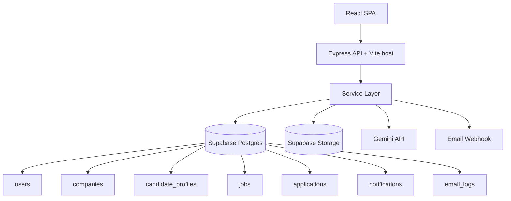
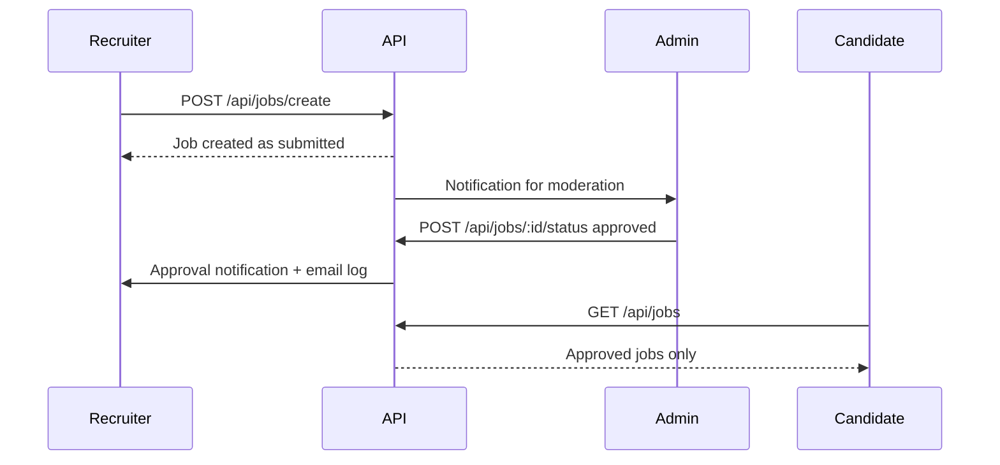

# Persevex Job Portal


Production-oriented full-stack hiring platform for candidates, recruiters, and admins. The current implementation runs as a single Node/Express server that hosts both the React SPA and the API, persists application data in Supabase, stores resumes and verification files in Supabase Storage, and optionally uses Gemini for resume extraction with local parser fallbacks.

## Overview

Persevex is built around three verified workspaces:

- Candidate workspace for profile completion, resume parsing, job discovery, application submission, application tracking, and notification review.
- Recruiter workspace for company verification setup, job submission, applicant pipeline review, and candidate status updates after admin forwarding.
- Admin workspace for company verification, job moderation, candidate screening, notification/email auditing, and top-level platform metrics.

The current codebase is not a marketplace placeholder. It includes implemented authentication, Supabase-backed persistence, file storage flows, resume parsing, application scoring, moderation gates, and communication logging. It does not currently include a real WebSocket transport, a public REST users directory, or full CRUD endpoints for every recruiter/admin UI control.

## Features

### Candidate Features

| Feature | Status | Notes |
| --- | --- | --- |
| Account registration and login | Implemented | Candidate accounts are created through `/api/auth/register` and authenticated with signed bearer session tokens. |
| Session restore | Implemented | Frontend restores session from `localStorage` and validates it with `/api/auth/me`. |
| Profile editing | Implemented | Education, experience, skills, resume text, and resume file name can be updated. |
| Profile photo upload | Implemented | PNG/JPG/WebP/AVIF uploads stored in Supabase Storage. |
| Resume PDF upload and parsing | Implemented | Gemini-first, then `pdf-parse`, then regex extraction. |
| Resume autofill suggestions | Implemented | Resume pipeline can populate empty profile fields and suggest non-destructive updates. |
| Job browsing | Implemented | Candidates receive approved jobs only. |
| Search and filtering | Implemented | Search, type, location, skill, salary, experience, and sort options are client-side. |
| Smart apply | Implemented | Application scoring uses keyword overlap against job requirements. |
| Application tracking | Implemented | Candidate sees status pipeline, matched skills, missing skills, interview dates, and final result. |
| Notifications inbox | Implemented | Notification polling runs every 8 seconds from the SPA. |
| Email alert history | Implemented | Candidate can view their email log records. |
| Saved jobs | Partial | Session-local UI state only; not persisted in Supabase. |

### Recruiter Features

| Feature | Status | Notes |
| --- | --- | --- |
| Employer account registration | Implemented | Company users get a draft company profile on signup. |
| Company profile management | Implemented | Company details can be edited through `/api/companies/update`. |
| Verification document upload | Implemented | PDF and image uploads stored in Supabase Storage. |
| Company approval workflow | Implemented | Admin approves or rejects company verification. |
| Job posting | Implemented | Approved companies can submit jobs; recruiter-submitted jobs enter moderation as `submitted`. |
| Job list and pipeline views | Implemented | Recruiters can view only their own jobs and applications tied to their company. |
| Candidate status updates | Implemented | Recruiters can move forwarded applications to `interviewing`, `selected`, or `rejected`. |
| Recruiter analytics cards | Partial | Counts are live; several chart visuals are client-side summaries rather than server analytics. |
| Edit/duplicate/pause/close job controls | UI only | Buttons exist in the dashboard but no write endpoints back them yet. |

### Admin Features

| Feature | Status | Notes |
| --- | --- | --- |
| Company verification queue | Implemented | Admin can approve or reject company profiles. |
| Job moderation queue | Implemented | Admin can approve or reject recruiter-submitted jobs. |
| Candidate screening desk | Implemented | Admin can move applications through review, shortlist, and forwarded stages. |
| Internal notes | Implemented | Notes persist to the `applications` table. |
| Bulk application actions | Implemented in UI | Bulk status updates call existing application status endpoints. |
| Email audit log | Implemented | Reads from `email_logs`; admins can retry failed or pending logs. |
| Platform summary metrics | Implemented | `/api/analytics/summary` returns live counts. |
| User directory | Partial | Admin UI currently uses hard-coded sample users because there is no `/api/users` endpoint. |

### AI Features

| Feature | Status | Notes |
| --- | --- | --- |
| Gemini resume extraction | Optional | Uses `gemini-3.5-flash` when `GEMINI_API_KEY` is configured and valid. |
| Local PDF text extraction | Implemented | Uses `pdf-parse` when Gemini is unavailable or insufficient. |
| Regex fallback extraction | Implemented | Ensures a final extraction layer even without Gemini. |
| Skill normalization | Implemented | Consolidates aliases such as `Node`, `Node.js`, `ReactJS`, `ML`, etc. |
| Confidence scoring | Implemented | Returns per-field confidence and overall confidence. |
| Career readiness signals | Implemented | Internship readiness, placement readiness, missing skills, and recommended roles. |
| Match scoring for applications | Implemented | Keyword overlap against required job skills; not LLM-based ranking. |

## Tech Stack

| Layer | Tools |
| --- | --- |
| Frontend | React 19, TypeScript, Vite 6, Motion, Recharts, Lucide |
| Backend | Node.js, Express 4, TypeScript, `tsx`, `esbuild` |
| Database | Supabase Postgres |
| Storage | Supabase Storage (`avatars`, `resumes`, `company-documents`) |
| AI | `@google/genai` (Gemini), `pdf-parse`, regex/entity extraction |
| Auth | Custom HMAC-signed bearer session tokens + scrypt password hashing |
| Testing | TypeScript compile check, resume fixture tests, communication fixture tests |

## System Architecture



### Runtime Notes

- `npm run dev` starts the full stack on `http://127.0.0.1:3000`.
- In development, Express mounts Vite middleware instead of running a separate frontend server.
- In production, `dist/server.cjs` serves both the built SPA and the API.
- Notifications are refreshed via polling, not WebSockets.

## Folder Structure

```text
JOB-Portal/
|-- lib/
|   `-- supabase.ts
|-- public/
|   `-- persevex_logo.avif
|-- reports/
|   |-- applications-indexes.sql
|   |-- applications-schema-migration.sql
|   |-- email-logs-schema-migration.sql
|   |-- notifications-schema-migration.sql
|   `-- id-mapping-report.json
|-- scripts/
|   |-- communication-reliability-tests.ts
|   |-- resume-intelligence-tests.ts
|   |-- smoke-e2e.ts
|   |-- seed-candidate-profiles-to-supabase.ts
|   |-- seed-companies-to-supabase.ts
|   `-- seed-jobs-migration.ts
|-- services/
|   |-- applicationService.ts
|   |-- authService.ts
|   |-- candidateProfileService.ts
|   |-- communicationService.ts
|   |-- companyService.ts
|   |-- configService.ts
|   |-- emailLogService.ts
|   |-- jobService.ts
|   |-- logger.ts
|   |-- notificationService.ts
|   |-- resumeIntelligenceService.ts
|   `-- userService.ts
|-- src/
|   |-- App.tsx
|   |-- index.css
|   |-- main.tsx
|   |-- types.ts
|   |-- animations/
|   |-- components/
|   |   |-- AdminDashboard.tsx
|   |   |-- AuthScreen.tsx
|   |   |-- CandidateDashboard.tsx
|   |   |-- CareerEcosystem.tsx
|   |   |-- CompanyDashboard.tsx
|   |   |-- Navbar.tsx
|   |   `-- motion/
|   `-- tokens/
|-- supabase/
|   `-- migrations/
|-- server.ts
|-- package.json
|-- tsconfig.json
|-- vite.config.ts
`-- README.md
```

## Getting Started

### Prerequisites

- Node.js 20+ recommended
- npm 10+
- Supabase project with the required tables and storage access
- Gemini API key only if you want LLM-assisted resume extraction

### Installation

```bash
npm install
```

### Environment Variables

Create a local `.env` file.

| Variable | Required | Purpose |
| --- | --- | --- |
| `VITE_SUPABASE_URL` | Yes | Supabase project URL used by both browser and server helpers. |
| `VITE_SUPABASE_ANON_KEY` | Yes | Frontend-safe Supabase anon key. |
| `SUPABASE_SERVICE_ROLE_KEY` | Yes | Server-side Supabase admin access for persistence and storage. |
| `AUTH_SECRET` | Recommended | HMAC secret for bearer session signing. |
| `AUTH_SESSION_SECRET` | Optional fallback | Alternate session signing secret if `AUTH_SECRET` is not used. |
| `GEMINI_API_KEY` | Optional | Enables Gemini resume extraction. |
| `EMAIL_DELIVERY_ENABLED` | Optional | When truthy, email delivery attempts are sent to the webhook provider. |
| `EMAIL_WEBHOOK_URL` | Conditionally required | Required if `EMAIL_DELIVERY_ENABLED=true`. |
| `RESUME_STORAGE_BUCKET` | Optional | Overrides default `resumes` bucket name. |
| `PROFILE_PHOTO_STORAGE_BUCKET` | Optional | Overrides default `avatars` bucket name. |
| `COMPANY_DOCUMENT_STORAGE_BUCKET` | Optional | Overrides default `company-documents` bucket name. |
| `CORS_ORIGIN` | Optional | Explicit production CORS origin. |
| `AUTH_BOOTSTRAP_EMAIL` | Optional | One-time bootstrap login email for legacy users without password hashes. |
| `AUTH_BOOTSTRAP_PASSWORD` | Optional | Matching bootstrap password. |
| `LOG_LEVEL` | Optional | Set to `debug` for verbose server logging. |
| `NODE_ENV` | Optional | `development` or `production`. |
| `DISABLE_HMR` | Optional | Disables Vite HMR/file watch for agent-driven editing workflows. |

### Example `.env`

```env
VITE_SUPABASE_URL=https://your-project.supabase.co
VITE_SUPABASE_ANON_KEY=your-anon-key
SUPABASE_SERVICE_ROLE_KEY=your-service-role-key
AUTH_SECRET=replace-with-a-long-random-secret

GEMINI_API_KEY=optional-gemini-key
EMAIL_DELIVERY_ENABLED=false
EMAIL_WEBHOOK_URL=
RESUME_STORAGE_BUCKET=resumes
PROFILE_PHOTO_STORAGE_BUCKET=avatars
COMPANY_DOCUMENT_STORAGE_BUCKET=company-documents
```

### Run Development Server

```bash
npm run dev
```

This starts:

- Express API on port `3000`
- Vite middleware for the React app
- Health endpoint at `/health`
- Readiness endpoint at `/ready`

### Build for Production

```bash
npm run build
```

Artifacts:

- `dist/index.html` and frontend assets
- `dist/server.cjs` bundled production server

### Start Production Build

```bash
npm run start
```

### Development Workflow

| Command | What it does | Verified |
| --- | --- | --- |
| `npm run dev` | Runs the full-stack development server through `tsx server.ts`. | Yes |
| `npm run build` | Builds the SPA with Vite and bundles the server with esbuild. | Yes |
| `npm run start` | Runs `dist/server.cjs`. | Derived from build output |
| `npm run lint` | TypeScript compile check with `tsc --noEmit`. | Yes |
| `npm run test` | Runs resume tests and communication tests. | Yes |
| `npm run test:resume` | Resume parsing and autofill fixture tests. | Yes |
| `npm run test:communications` | Communication event and email template fixture tests. | Yes |
| `npm run clean` | Removes build artifacts with `rm -rf dist server.js`. | Present, but shell-specific |

Additional repo script:

- `npx tsx scripts/smoke-e2e.ts` performs a full end-to-end workflow against a running local server and Supabase-backed environment, but it is not currently exposed as an npm script.

## Database Design

### Core Tables

| Table | Purpose |
| --- | --- |
| `users` | Platform identities, roles, status, and `password_hash`. |
| `companies` | Recruiter company profile, contact info, verification state, and uploaded document metadata. |
| `candidate_profiles` | Candidate education, skills, experience, resume text, file name, and resume storage reference. |
| `jobs` | Job postings, denormalized company name, requirements, preferred skills, moderation status, and view count. |
| `applications` | Candidate-to-job records with score, matched skills, missing skills, notes, interview date, and final result. |
| `notifications` | In-app notifications, including `all_admin` broadcast records. |
| `email_logs` | Email audit trail, status, retry support, and rendered HTML body. |

### Schema and Index Highlights

- Unique email index on `lower(users.email)`
- One candidate profile per `user_id`
- One application per `(candidate_id, job_id)`
- Status check constraints for users, companies, jobs, and applications
- Indexes for recruiter pipeline queries and notification unread counts
- Application foreign key aligned to `candidate_profiles.id`

## API Integrations

### Supabase

- Postgres is the source of truth for app data.
- Supabase Storage holds:
  - resumes
  - candidate profile photos
  - recruiter verification documents
- The server auto-creates required buckets at startup if they do not exist.

### Email Provider

- Email sending is abstracted behind `EMAIL_WEBHOOK_URL`.
- If delivery is disabled, the system still writes `email_logs` for observability and manual retry.

### Health Endpoints

| Endpoint | Purpose |
| --- | --- |
| `GET /health` | Basic process liveness |
| `GET /ready` | Readiness check for database, Gemini configuration, and email configuration |

## AI Integrations

### Gemini Integration

- Uses `@google/genai`
- Model: `gemini-3.5-flash`
- Input: base64 PDF resume
- Output: strict JSON resume shape
- Timeout protection: 18 seconds
- Gemini is optional; invalid or missing API keys fall back to local parsing

### Resume/PDF Parsing Pipeline

1. Validate that the upload is a real PDF.
2. Try Gemini extraction when configured.
3. Run `pdf-parse` text extraction.
4. Run regex/entity extraction for fallback and normalization.
5. Generate:
   - parsed profile fields
   - field confidence scores
   - overall confidence
   - missing skills
   - recommended roles
   - internship and placement readiness scores
   - autofill suggestions

### AI-Powered vs Non-AI Scoring

- Resume extraction and career insight generation can use Gemini.
- Application match scoring is currently deterministic keyword matching, not LLM ranking.

## Authentication System

- Custom registration and login endpoints
- Passwords hashed with Node `scrypt`
- Signed bearer session tokens using HMAC-SHA256
- Session validation via `/api/auth/me`
- Role checks enforced on every protected route
- Optional bootstrap path for migrating legacy users without password hashes

## Resume Parsing System

- Candidate-only upload endpoint: `POST /api/parser/pdf`
- Stores the uploaded resume reference in Supabase Storage
- Applies non-destructive autofill to empty candidate profile fields
- Returns parsing warnings and errors to the frontend
- Rejects empty, invalid, or unreadable PDFs with explicit errors

## Profile Management

### Candidate

- Read own profile
- Update education, skills, experience, resume text, and resume filename
- Upload or remove avatar/profile photo
- Fetch signed or resolved resume URL

### Recruiter

- Maintain company profile and contact fields
- Upload multiple verification documents
- Preview latest uploaded document through resolved storage URLs

## Job Posting Workflow



Notes:

- Admin-created internal jobs can be inserted directly as approved.
- Recruiters must be company-approved before they can submit jobs.
- View tracking is implemented through `POST /api/jobs/:id/view`.

## Candidate Workflow

1. Register as a candidate.
2. Auto-create an empty candidate profile.
3. Upload a profile photo.
4. Upload a PDF resume for parsing and autofill.
5. Review job matches and filters.
6. Apply with current resume signal.
7. Track status from `applied` to `selected` or `rejected`.
8. Review notifications and email history.

## Recruiter Workflow

1. Register as a company user.
2. Complete company profile and upload verification documents.
3. Wait for admin company approval.
4. Submit jobs for moderation.
5. Receive approved jobs in recruiter dashboard.
6. Review only applications associated with that company.
7. Move forwarded candidates to interview, hire, or reject.

## Admin Capabilities

- Approve or reject company verification
- Approve or reject recruiter-submitted jobs
- Move candidate applications through review stages
- Add internal notes to applications
- Review email audit log and retry failed logs
- View top-level counts for companies, jobs, and applications

Current limitations worth knowing:

- Admin user directory is mocked in the frontend and not backed by an API.
- Some analytics trend data is illustrative rather than fully derived from historical records.

## File Upload and Storage Architecture

| Upload Type | Bucket | Access Pattern | Validation |
| --- | --- | --- | --- |
| Candidate resume PDF | `resumes` | Stored by `userId/profileId/...`; resolved with signed URLs | PDF only |
| Candidate avatar | `avatars` | Stored by `userId/profileId/...`; latest image is resolved for the dashboard | PNG/JPG/WebP/AVIF, max 3 MB |
| Company verification documents | `company-documents` | Stored by `userId/companyId/...`; resolved with signed URLs | PDF/PNG/JPG/WebP, max 6 MB |

## Real-Time Features

There is no WebSocket or Supabase Realtime subscription layer in the current codebase.

What exists today:

- Notification polling every 8 seconds from the SPA
- Immediate persistence of notifications and email logs in Supabase
- Status updates reflected on next poll or reload

## Notification Systems

- In-app notifications stored in `notifications`
- Broadcast admin notifications via `recipient_id = all_admin`
- Email event logging stored in `email_logs`
- Retry endpoint for admins: `POST /api/email-alerts/:id/retry`
- Communication events cover:
  - welcome
  - password reset requests
  - application submitted
  - application reviewed
  - interview scheduled
  - application accepted/rejected
  - job approved/rejected
  - company approved/rejected

## Search, Filtering, and Reporting

Implemented:

- Candidate job search and filters
- Recruiter job list filters
- Recruiter pipeline grouping
- Admin summary metrics
- Admin chart views for application and job trends

Caveats:

- Candidate filtering is client-side after approved jobs are fetched.
- Recruiter analytics visuals are mostly client-side aggregates.
- Admin summary counts are live, but trend series include synthesized values.

## Security

- Password hashing with `scrypt`
- Signed bearer sessions
- Role-based route authorization
- Request rate limiting on login, registration, forgot-password, and resume parsing
- Secure response headers:
  - `X-Frame-Options: DENY`
  - `X-Content-Type-Options: nosniff`
  - `Referrer-Policy: no-referrer`
  - `Permissions-Policy`
  - content security policy
- Service-role Supabase client kept server-side
- Signed storage URL generation for private assets
- Request ID logging for observability

## Deployment

### Current Deployment Shape

This repository is ready for a single-service Node deployment:

1. Install dependencies.
2. Provide all required environment variables.
3. Run `npm run build`.
4. Start with `npm run start`.

### Production Notes

- The server binds to `0.0.0.0` in production.
- Static frontend assets are served from `dist/`.
- Ensure Supabase tables, indexes, and storage buckets exist or allow the server to create buckets at startup.
- Health checks can target `/health` and `/ready`.

### Database Migration Notes

- `supabase/migrations/` contains the latest compatibility and hardening migrations.
- `reports/*.sql` contains supplemental schema scripts for tables and indexes discovered during audits.
- Some legacy seed scripts still reference `server_db.json`, which is no longer present in the current repository root.

## Screenshots (Placeholder)

- Candidate workspace dashboard
- Recruiter command center
- Admin moderation desk
- Resume intelligence panel
- Notification and email audit views

## Roadmap

Roadmap items below are based on gaps verified in the current implementation.

- Add a real admin users API instead of frontend mock data
- Persist candidate saved jobs
- Add recruiter job edit/duplicate/pause/close backend endpoints
- Replace synthetic analytics series with historical reporting data
- Add first-class smoke test npm script and CI automation
- Remove legacy JSON seed dependencies or restore migration fixtures intentionally
- Add optional realtime transport for notifications and pipeline changes
- Add explicit deployment manifests for Docker or platform hosting if needed

## Contributing

Suggested contribution workflow:

1. Install dependencies with `npm install`
2. Configure `.env`
3. Run `npm run dev`
4. Validate changes with:
   - `npm run lint`
   - `npm run test`
   - `npm run build`
5. If you touch cross-role workflows, also run `npx tsx scripts/smoke-e2e.ts` against a configured local environment

## License

No `LICENSE` file is currently present in this repository. Treat usage and redistribution as undefined until a project license is added.

## Authors

The repository does not currently include a formal `AUTHORS` file or package metadata for maintainers. If authorship should be public, add an explicit authors section or metadata source to keep this README authoritative.
